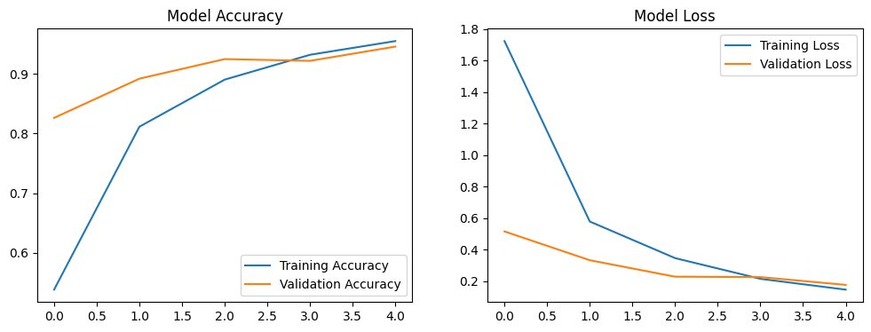
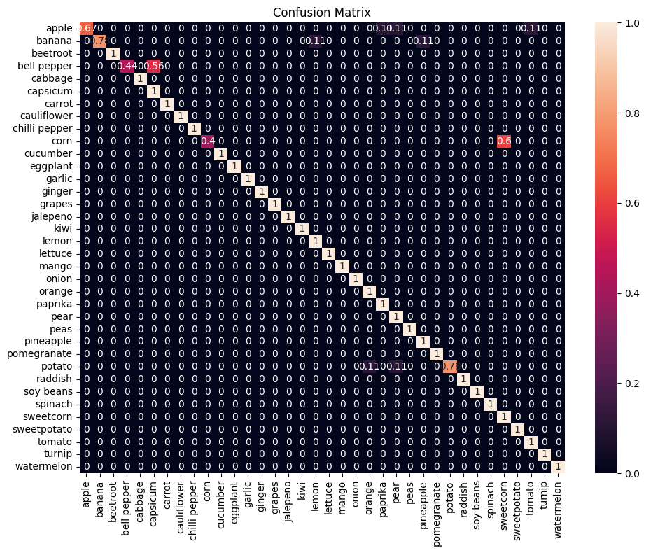

#  Fruit and Vegetable Classification System

A deep learning-based image classification system that can identify **36 different types of fruits and vegetables** with high accuracy using **TensorFlow** and **Transfer Learning**.

---

##  Project Overview
This project implements a **Convolutional Neural Network (CNN)** using **MobileNetV2** as the base model for classifying images of fruits and vegetables.  
The model achieves **high accuracy** in distinguishing between 36 different classes of produce items.

---

##  Features
- **Transfer Learning** – Uses pre-trained **MobileNetV2** for feature extraction  
- **Data Augmentation** – Real-time augmentation improves generalization  
- **Grad-CAM Visualization** – Explainable AI to understand predictions  
- **Comprehensive Evaluation** – Accuracy, confusion matrix, per-class metrics  
- **Easy Deployment** – Includes prediction script for new images  

---

##  Technical Details

### Model Architecture
- **Base Model:** MobileNetV2 (pre-trained on ImageNet)  
- **Custom Layers:**  
  - Global Average Pooling  
  - Dense (128 units, ReLU)  
  - Dense (128 units, ReLU)  
  - Output Layer: 36 units, Softmax  

- **Input Size:** 224×224×3  
- **Optimizer:** Adam  
- **Loss Function:** Categorical Crossentropy  

### Data Augmentation
- Rotation: ±30°  
- Zoom: ±15%  
- Width/Height Shift: ±20%  
- Shear: ±15%  
- Horizontal Flip: ✅  

---

##  Dataset
The dataset contains images of **36 classes** of fruits and vegetables, split into:
- **Training Set** – for learning  
- **Validation Set** – for tuning & early stopping  
- **Test Set** – for final evaluation  

 Dataset Link: [Download from Kaggle](https://www.kaggle.com/code/abdelrahman16/fruit-and-vegetable-classification/input)  

---

##  Performance
- **Test Accuracy:** *[Add your accuracy here]* %  
- **Training Time:** ~X minutes/epoch on *[Your Hardware]*  
- **Model Size:** *[Size of saved model]*  

---

Model Training

Training Parameters:
Batch Size: 32
Epochs: 5 (with early stopping)
Early Stopping Patience: 2 epochs
Learning Rate: 0.001 (Adam default)

Evaluation Metrics

This project provides detailed evaluation including:

Accuracy scores
Classification report
Confusion matrix (normalized & count-based)
Per-class accuracy
Misclassification analysis

Visualization Features

Sample Images from dataset
Training Curves (Accuracy & Loss over epochs)
Confusion Matrix (heatmap)
Grad-CAM heatmaps for model explainability
Misclassification examples

Model Interpretation

The Grad-CAM implementation helps visualize:
Which image regions influenced predictions
How the model makes decisions
Potential biases in classification

Key Findings

Model achieves high accuracy across most classes
Some confusion between visually similar items
Data augmentation significantly improves generalization
Transfer learning provides a strong baseline

Future Improvements

Try other base models (EfficientNet, ResNet, etc.)
More advanced data augmentation strategies
Ensemble methods for better accuracy
Deploy as a Streamlit or FastAPI web app
Add real-time camera input classification
## Results

### Training Progress  
  

### Confusion Matrix  
  

---

## 🔍 Making Predictions
You can use the provided script to classify new images:

```python
from predict import predict_image

# Classify a new image
class_name, confidence = predict_image("path/to/your/image.jpg")
print(f"Predicted: {class_name} with {confidence:.2%} confidence")

